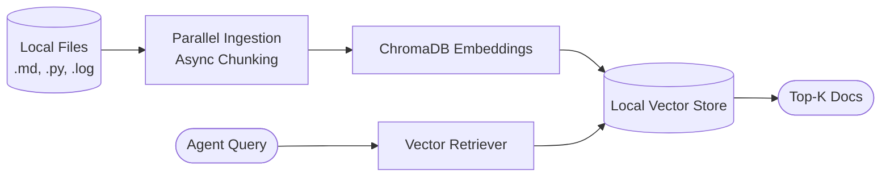

# 🐕 Bruno — The Terminal Research Agent

[](https://github.com/youruser/bruno/actions/workflows/ci.yml)

> An intelligent CLI assistant that helps developers debug errors, research topics, and query local knowledge — all without leaving the terminal.

Bruno is built with LangGraph, ChromaDB, and Model Context Protocol (MCP) servers to provide an agentic workflow that reads your local files, executes secure SQLite queries, checks environment variables, and synthesizes answers using RAG.

---

## 🏗️ Architecture & Schematic Diagrams

Bruno operates on a state-machine architecture powered by **LangGraph**. When a user inputs a query, the intent classifier routes it to the appropriate sub-agent. The agents have access to local RAG knowledge and MCP tools.

### Core Agent Workflow


### Knowledge Base (RAG) Pipeline



---

## 📁 Repository Structure

Here is a breakdown of how the codebase is organized:

```text
bruno/
├── src/bruno/
│   ├── agent/               # LangGraph state machine & AI logic
│   │   ├── nodes/           # Classifier, Debugger, Researcher, Formatter
│   │   ├── tools/           # RAG retrieval and Web search tools
│   │   └── graph.py         # The compiled StateGraph & Checkpointer
│   ├── cli/                 # Typer CLI application
│   │   ├── commands/        # CLI subcommands (debug, research, index, config)
│   │   └── formatters.py    # Rich UI console rendering
│   ├── mcp_servers/         # Model Context Protocol (MCP) servers
│   │   ├── env_server.py    # Secure env-var reader
│   │   ├── filesystem_server.py # Sandboxed file reader
│   │   └── sqlite_server.py # Read-only SQLite query engine
│   ├── rag/                 # Retrieval Augmented Generation logic
│   │   ├── embeddings.py    # SentenceTransformers embeddings setup
│   │   ├── ingestion.py     # Parallel file chunking and parsing
│   │   ├── retriever.py     # LangChain compatible vector retrieval
│   │   └── store.py         # ChromaDB persistence layer
│   └── config.py            # Pydantic settings & validation
├── tests/                   # Pytest test suite (100% coverage)
├── pyproject.toml           # Poetry/Pip build system & dependencies
└── .github/workflows/       # CI/CD pipelines
```

---

## 🚀 Local Deployment Guide

Follow these easy steps to get Bruno running on your local machine.

### Prerequisites
- Python 3.10 or higher
- An OpenAI API Key (or Groq API key)

### 1. Clone & Install
Clone the repository and install it in "editable" mode so you can tweak the code while using the CLI globally.

```bash
git clone https://github.com/yourusername/bruno.git
cd bruno
python -m venv .venv

# Windows
.\.venv\Scripts\activate
# Mac/Linux
source .venv/bin/activate

# Install the CLI and dependencies
pip install -e "."
```

### 2. Configuration Setup
Run the setup wizard to securely store your API keys in `~/.bruno_data/.env`.

```bash
bruno config init
```
*(When prompted, enter your OpenAI API key).*

### 3. Build Your Knowledge Base
Point Bruno to your local documents, codebase, or logs to build the RAG index. Bruno uses parallel processing to chew through large directories quickly!

```bash
bruno index add ./docs --recursive
```

---

## ⚡ Usage Examples

Once configured and indexed, Bruno is ready to assist you.

**1. Debug an Error:**
> Bruno will read the error, access your local files via MCP, check the RAG index for related logs, and stream the fix back to you.
```bash
bruno debug "ModuleNotFoundError: No module named 'pydantic'"
```

**2. Deep Research:**
> Ask Bruno to research a topic. It will search the web and your local notes, streaming the response.
```bash
bruno research "How does LangGraph compare to standard LangChain agents?" --depth deep
```

**3. Manage the Index:**
```bash
bruno index list
bruno index clear --yes
```

---

## ✨ Advanced Optimizations Implemented
- **Streaming UI**: Tokens are streamed directly to your terminal in real-time using `Rich` components.
- **Parallel Indexing**: The document ingestion pipeline uses thread-pooling with semaphores to ensure blazing fast parsing without freezing your CPU.
- **Persistent Chat Memory**: Bruno remembers the context of your conversation per-directory. You can run `bruno debug` multiple times in a row and the agent will remember what you were just working on using a local SQLite checkpointer!
