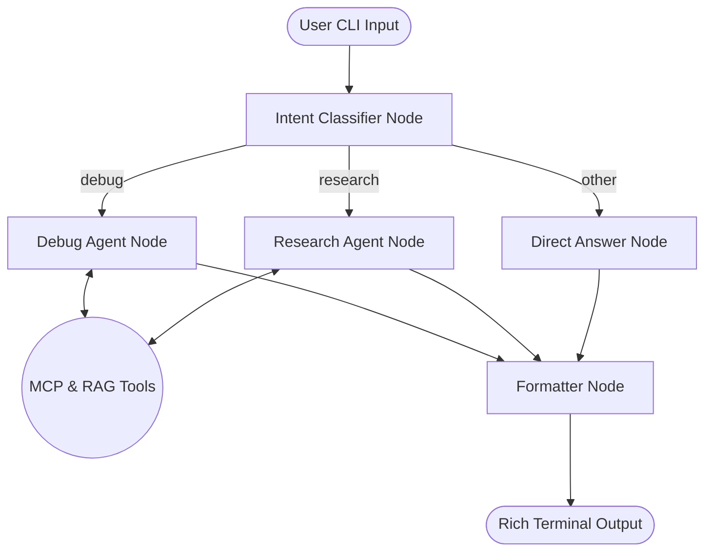

# 🐕 Bruno — The Terminal Research Agent

[](https://github.com/Pranjalexe/bruno/actions/workflows/ci.yml)

> An intelligent CLI assistant that helps developers debug errors, research topics, and query local knowledge — all without leaving the terminal.

Bruno is built with LangGraph, ChromaDB, and Model Context Protocol (MCP) servers to provide an agentic workflow that reads your local files, executes secure SQLite queries, checks environment variables, and synthesizes answers using RAG.

---

## 🏗️ Architecture & Schematic Diagrams

Bruno operates on a state-machine architecture powered by **LangGraph**. When a user inputs a query, the intent classifier routes it to the appropriate sub-agent. The agents have access to local RAG knowledge and MCP tools.

### Core Agent Workflow



### Knowledge Base (RAG) Pipeline


---

## 📁 Repository Structure

Here is a breakdown of how the codebase is organized:

```text
bruno/
├── src/bruno/
│   ├── agent/               # LangGraph state machine & AI logic
│   │   ├── nodes/           # Classifier, Debugger, Researcher, Formatter
│   │   ├── tools/           # RAG retrieval and Web search tools
│   │   └── graph.py         # The compiled StateGraph & Checkpointer
│   ├── cli/                 # Typer CLI application
│   │   ├── commands/        # CLI subcommands (debug, research, index, config)
│   │   └── formatters.py    # Rich UI console rendering
│   ├── mcp_servers/         # Model Context Protocol (MCP) servers
│   │   ├── env_server.py    # Secure env-var reader
│   │   ├── filesystem_server.py # Sandboxed file reader
│   │   └── sqlite_server.py # Read-only SQLite query engine
│   ├── rag/                 # Retrieval Augmented Generation logic
│   │   ├── embeddings.py    # SentenceTransformers embeddings setup
│   │   ├── ingestion.py     # Parallel file chunking and parsing
│   │   ├── retriever.py     # LangChain compatible vector retrieval
│   │   └── store.py         # ChromaDB persistence layer
│   └── config.py            # Pydantic settings & validation
├── tests/                   # Pytest test suite (100% coverage)
├── pyproject.toml           # Poetry/Pip build system & dependencies
└── .github/workflows/       # CI/CD pipelines
```

---

## 🚀 Local Deployment Guide

Follow these easy steps to get Bruno running on your local machine.

### Prerequisites
- Python 3.10 or higher
- A Google Gemini API Key (free from Google AI Studio)

### 1. Clone & Install
Clone the repository and install it in "editable" mode so you can tweak the code while using the CLI globally.

```bash
git clone https://github.com/Pranjalexe/bruno.git
cd bruno
python -m venv .venv

# Windows
.\.venv\Scripts\activate
# Mac/Linux
source .venv/bin/activate

# Install the CLI and dependencies
pip install -e "."
```

### 2. Configuration Setup
Run the setup wizard to securely store your API keys in `~/.bruno_data/.env`.

```bash
bruno config init
```
*(When prompted, enter your Google Gemini API key).*

### 3. Build Your Knowledge Base
Point Bruno to your local documents, codebase, or logs to build the RAG index. Bruno uses parallel processing to chew through large directories quickly!

```bash
bruno index add ./docs --recursive
```

---

## 💻 CLI Commands Reference

Bruno uses a modern Typer CLI interface. Here are all the available commands:

### `bruno config`
Manage your configuration and API keys.
- `bruno config init`: Interactive wizard to set up your `.env` file (stores Gemini API keys).
- `bruno config show`: Print your current configuration settings.

### `bruno index`
Manage the ChromaDB local knowledge base.
- `bruno index add <path> [--recursive] [--collection <name>]`: Parses, chunks, and embeds files into your local RAG database.
- `bruno index list`: Shows statistics about your vector database (total documents, collections).
- `bruno index clear [--collection <name>] [--yes]`: Wipes the vector database.

### `bruno debug`
The core debugging agent.
- `bruno debug "<error_message>"`: Debug an issue. Bruno will autonomously use tools to find the solution.
- `bruno debug "<error_message>" --file <path> --context <lines>`: Attach specific log file lines to the prompt.

### `bruno research`
The deep-dive research agent.
- `bruno research "<topic>"`: Let Bruno compile a research report on a topic.
- `bruno research "<topic>" --depth deep`: Instructs Bruno to do a more thorough, multi-step web search before answering.

---

## ⚡ Usage Examples

Once configured and indexed, Bruno is ready to assist you.

**1. Debug an Error:**
> Bruno will read the error, access your local files via MCP, check the RAG index for related logs, and stream the fix back to you.
```bash
bruno debug "ModuleNotFoundError: No module named 'pydantic'"
```

**2. Deep Research:**
> Ask Bruno to research a topic. It will search the web and your local notes, streaming the response.
```bash
bruno research "How does LangGraph compare to standard LangChain agents?" --depth deep
```

**3. Manage the Index:**
```bash
bruno index list
bruno index clear --yes
```

---

## ✨ Advanced Optimizations Implemented
- **Streaming UI**: Tokens are streamed directly to your terminal in real-time using `Rich` components.
- **Parallel Indexing**: The document ingestion pipeline uses thread-pooling with semaphores to ensure blazing fast parsing without freezing your CPU.
- **Persistent Chat Memory**: Bruno remembers the context of your conversation per-directory. You can run `bruno debug` multiple times in a row and the agent will remember what you were just working on using a local SQLite checkpointer!

---

## 🛠️ Development & Contributing

Want to extend Bruno or run tests locally?

### Running Tests
Bruno has 100% test coverage using `pytest`.
```bash
# Run all tests
pytest tests/ -v

# Run with coverage report
pytest tests/ -v --cov=bruno --cov-report=term-missing
```

### Code Formatting & Linting
We use `ruff` for fast linting and formatting, and `mypy` for static type checking.
```bash
ruff check src/ tests/
ruff format src/ tests/
mypy src/bruno/ --ignore-missing-imports
```

### Adding a New MCP Server
Bruno's tools are dynamically loaded via MCP. To add a new capability:
1. Create a new server file in `src/bruno/mcp_servers/` using the `@mcp.tool()` decorator.
2. Expose the server command via `stdio`.
3. Add the server command to the `mcp_servers` dict in `src/bruno/config.py`.

---

## 🆘 Troubleshooting & FAQ

| Issue | Cause | Fix |
|-------|-------|-----|
| `ModuleNotFoundError: No module named 'bruno'` | Package not installed in editable mode | Run `pip install -e ".[dev]"` |
| `chromadb.errors.NoIndexException` | Querying an empty knowledge base | Run `bruno index add ./docs` first |
| `google.api_core.exceptions.InvalidArgument` | Invalid or missing API key | Run `bruno config init` or set `BRUNO_GEMINI_API_KEY` |
| Agent loops infinitely | Context window filled with tool errors | Ensure MCP servers print debug logs to `sys.stderr`, not `stdout` |
| `RuntimeError: This event loop is already running` | Nested asyncio calls in sync Typer CLI | Use `asyncio.run()` only at the top-level Typer command |

---

## ⚙️ Environment Variables Reference

Bruno stores configuration in `~/.bruno_data/.env` by default, but you can override these via your terminal:

| Variable | Description | Default |
|----------|-------------|---------|
| `BRUNO_GEMINI_API_KEY` | Your Google Gemini API key for LLM generation | *Required* |
| `BRUNO_DATA_DIR` | Directory for SQLite memory and ChromaDB | `~/.bruno_data/` |
| `BRUNO_DEFAULT_MODEL` | The LLM model to use | `gemini-2.5-flash` |
| `BRUNO_LOG_LEVEL` | Logging verbosity (`INFO`, `DEBUG`) | `INFO` |
