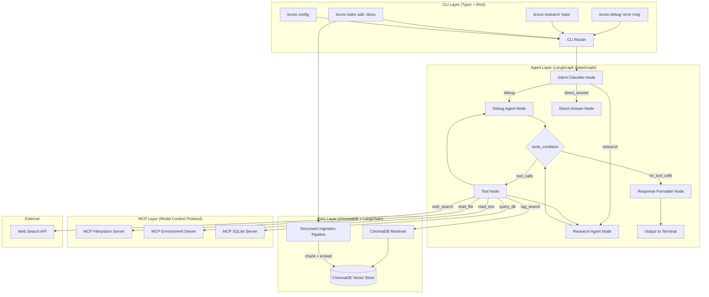
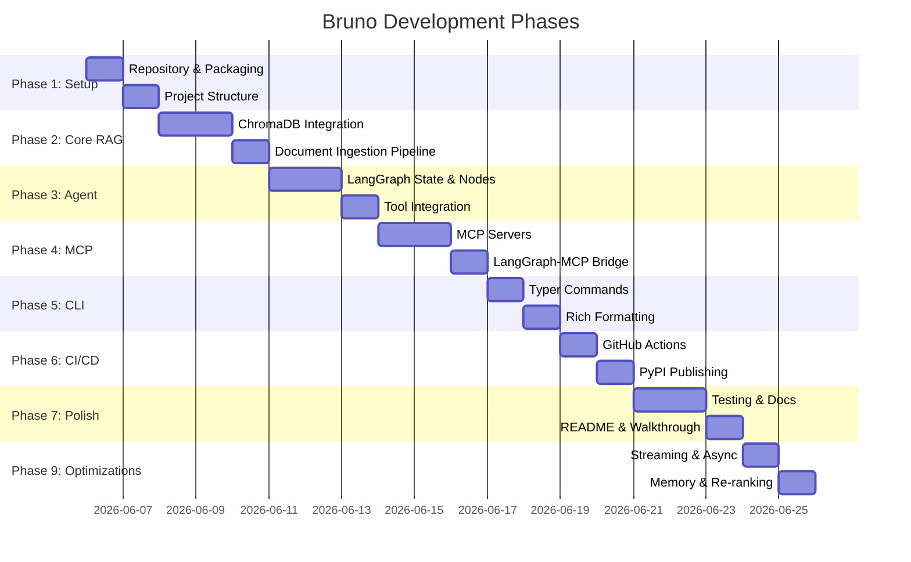

# Bruno — The Terminal Research Agent

> An intelligent CLI assistant that helps developers debug errors, research topics, and query local knowledge — all without leaving the terminal.

## Overview

**Bruno** is a Python CLI tool powered by a LangGraph agentic workflow. It uses RAG (Retrieval-Augmented Generation) over local project files and logs, MCP (Model Context Protocol) for secure access to external tools and local resources, and a ChromaDB vector database for persistent knowledge storage. The project demonstrates production-grade software engineering with full CI/CD via GitHub Actions and publishable to PyPI.

### Tech Stack Summary

| Layer | Technology | Purpose |
|-------|-----------|---------|
| CLI Framework | **Typer** + **Rich** | Command interface & terminal formatting |
| Agent Orchestration | **LangGraph** (StateGraph) | Agentic workflow with conditional routing |
| RAG Pipeline | **LangChain** + **ChromaDB** | Document ingestion, embedding, retrieval |
| Tool Integration | **MCP** (Model Context Protocol) | Secure access to filesystem, env vars, DBs |
| LLM Provider | **OpenAI** (with Groq/Ollama fallback) | Language model inference |
| Embeddings | **sentence-transformers** (`all-MiniLM-L6-v2`) | Local embedding generation |
| CI/CD | **GitHub Actions** | Lint, test, build, publish to PyPI |
| Package Manager | **pyproject.toml** + **pip** | Modern Python packaging |

---

## Architecture Diagram



---

## SDLC Phases



---

# Phase 1: Project Setup & Foundation

## 1.1 Repository Initialization

### Checklist
- [ ] Create a new directory `bruno/` at the project root
- [ ] Initialize git: `git init`
- [ ] Create `.gitignore` (Python template)
- [ ] Create `LICENSE` (MIT)
- [ ] Create initial `README.md` with project title and description

### `.gitignore`
```
# Python
__pycache__/
*.py[cod]
*$py.class
*.egg-info/
dist/
build/
*.egg

# Virtual environment
.venv/
venv/
env/

# IDE
.vscode/
.idea/

# Environment
.env

# ChromaDB data (user-generated)
.bruno_data/

# OS
.DS_Store
Thumbs.db
```

---

## 1.2 Project Structure

### Checklist
- [ ] Create all directories per the structure below
- [ ] Create all `__init__.py` files
- [ ] Create `pyproject.toml` with all dependencies
- [ ] Create `.env.example` with placeholder values
- [ ] Verify installation with `pip install -e ".[dev]"`

### Target Directory Structure
```
bruno/
├── .github/
│   └── workflows/
│       ├── ci.yml                  # Lint + test on every push/PR
│       └── publish.yml             # Publish to PyPI on tag push
├── src/
│   └── bruno/
│       ├── __init__.py             # Package version
│       ├── cli/
│       │   ├── __init__.py
│       │   ├── app.py              # Main Typer app with subcommands
│       │   ├── commands/
│       │   │   ├── __init__.py
│       │   │   ├── debug.py        # `bruno debug` command
│       │   │   ├── research.py     # `bruno research` command
│       │   │   ├── index.py        # `bruno index` command group
│       │   │   └── config.py       # `bruno config` command
│       │   └── formatters.py       # Rich output formatting helpers
│       ├── agent/
│       │   ├── __init__.py
│       │   ├── state.py            # AgentState TypedDict
│       │   ├── graph.py            # LangGraph StateGraph assembly
│       │   ├── nodes/
│       │   │   ├── __init__.py
│       │   │   ├── classifier.py   # Intent classification node
│       │   │   ├── debug_agent.py  # Debug reasoning node
│       │   │   ├── research_agent.py # Research reasoning node
│       │   │   ├── direct_answer.py  # Simple Q&A node
│       │   │   └── formatter.py    # Response formatting node
│       │   └── tools/
│       │       ├── __init__.py
│       │       ├── rag_tools.py    # ChromaDB search tool
│       │       ├── web_tools.py    # Web search tool
│       │       └── mcp_tools.py    # MCP-loaded tools
│       ├── rag/
│       │   ├── __init__.py
│       │   ├── ingestion.py        # Document loading & chunking
│       │   ├── embeddings.py       # Embedding function config
│       │   ├── store.py            # ChromaDB client wrapper
│       │   └── retriever.py        # LangChain retriever adapter
│       ├── mcp_servers/
│       │   ├── __init__.py
│       │   ├── filesystem_server.py  # Read local files via MCP
│       │   ├── env_server.py       # Read env vars via MCP
│       │   └── sqlite_server.py    # Query local SQLite DBs via MCP
│       └── config.py               # Configuration management
├── tests/
│   ├── __init__.py
│   ├── conftest.py                 # Shared fixtures
│   ├── test_cli/
│   │   ├── __init__.py
│   │   ├── test_debug.py
│   │   ├── test_research.py
│   │   ├── test_index.py
│   │   └── test_config.py
│   ├── test_agent/
│   │   ├── __init__.py
│   │   ├── test_state.py
│   │   ├── test_graph.py
│   │   └── test_nodes.py
│   ├── test_rag/
│   │   ├── __init__.py
│   │   ├── test_ingestion.py
│   │   ├── test_store.py
│   │   └── test_retriever.py
│   └── test_mcp/
│       ├── __init__.py
│       └── test_servers.py
├── docs/
│   ├── architecture.md
│   └── mermaid/
│       └── agent_flow.md
├── .env.example
├── .gitignore
├── LICENSE
├── README.md
└── pyproject.toml
```

### `pyproject.toml`
```toml
[build-system]
requires = ["hatchling"]
build-backend = "hatchling.build"

[project]
name = "bruno-cli"
version = "0.1.0"
description = "An intelligent CLI research agent for developers"
readme = "README.md"
license = {text = "MIT"}
requires-python = ">=3.11"
authors = [
    {name = "Your Name", email = "you@example.com"},
]
keywords = ["cli", "ai", "agent", "rag", "llm", "mcp", "langgraph"]
classifiers = [
    "Development Status :: 3 - Alpha",
    "Intended Audience :: Developers",
    "License :: OSI Approved :: MIT License",
    "Programming Language :: Python :: 3.11",
    "Programming Language :: Python :: 3.12",
    "Programming Language :: Python :: 3.13",
    "Topic :: Software Development :: Libraries",
]

dependencies = [
    # CLI & Display
    "typer[all]>=0.12.0",
    "rich>=13.7.0",
    
    # LLM & Agent
    "langgraph>=0.3.0",
    "langgraph-prebuilt>=0.1.0",
    "langchain>=0.3.0",
    "langchain-openai>=0.3.0",
    "langchain-community>=0.3.0",
    
    # RAG & Vector DB
    "langchain-chroma>=0.2.0",
    "chromadb>=1.0.0",
    "langchain-text-splitters>=0.3.0",
    
    # Embeddings (local)
    "sentence-transformers>=3.0.0",
    "langchain-huggingface>=0.1.0",
    
    # MCP
    "mcp[cli]>=1.0.0",
    "langchain-mcp-adapters>=0.1.0",
    
    # Config
    "python-dotenv>=1.0.0",
    "pydantic>=2.0.0",
    "pydantic-settings>=2.0.0",
]

[project.optional-dependencies]
dev = [
    "pytest>=8.0",
    "pytest-asyncio>=0.23.0",
    "pytest-cov>=5.0",
    "ruff>=0.5.0",
    "build>=1.0",
    "mypy>=1.10.0",
]

[project.scripts]
bruno = "bruno.cli.app:app"

[tool.ruff]
target-version = "py311"
line-length = 100

[tool.ruff.lint]
select = ["E", "W", "F", "I", "N", "UP", "B", "A", "SIM"]

[tool.pytest.ini_options]
testpaths = ["tests"]
asyncio_mode = "auto"

[tool.hatch.build.targets.wheel]
packages = ["src/bruno"]

[tool.mypy]
python_version = "3.11"
warn_return_any = true
warn_unused_configs = true
```

### `.env.example`
```bash
# LLM Provider (required)
OPENAI_API_KEY=sk-your-openai-api-key-here

# Alternative providers (optional)
GROQ_API_KEY=gsk_your-groq-api-key-here

# Bruno Configuration
BRUNO_DATA_DIR=~/.bruno_data
BRUNO_DEFAULT_MODEL=gpt-4o-mini
BRUNO_EMBEDDING_MODEL=all-MiniLM-L6-v2
BRUNO_LOG_LEVEL=INFO
```

### `src/bruno/__init__.py`
```python
"""Bruno — The Terminal Research Agent."""

__version__ = "0.1.0"
```

### Debugging Checklist (Phase 1)
- [ ] Run `pip install -e ".[dev]"` — verify no dependency conflicts
- [ ] Run `bruno --help` — verify Typer entry point works
- [ ] Run `python -c "import bruno; print(bruno.__version__)"` — verify package imports
- [ ] Run `ruff check src/` — verify linter config works
- [ ] Run `pytest --co` — verify test collection works (no tests yet, just structure)

---

# Phase 2: Core RAG Pipeline

## 2.1 Configuration Management

### Checklist
- [ ] Create `src/bruno/config.py` with Pydantic Settings model
- [ ] Support `.env` file loading
- [ ] Support environment variable overrides
- [ ] Support `~/.bruno/config.toml` for persistent user config
- [ ] Write unit tests for config loading

### `src/bruno/config.py` — Specification

```python
"""
Configuration management using pydantic-settings.

Priority order (highest to lowest):
1. Environment variables (BRUNO_*)
2. .env file in current directory
3. ~/.bruno/config.toml
4. Default values

Key settings:
- OPENAI_API_KEY: str (required for LLM inference)
- BRUNO_DATA_DIR: Path (default: ~/.bruno_data) — where ChromaDB stores vectors
- BRUNO_DEFAULT_MODEL: str (default: "gpt-4o-mini")
- BRUNO_EMBEDDING_MODEL: str (default: "all-MiniLM-L6-v2")
- BRUNO_LOG_LEVEL: str (default: "INFO")
- BRUNO_MCP_SERVERS: dict (optional, for custom MCP servers)
"""
```

**Implementation Notes:**
- Use `pydantic_settings.BaseSettings` with `env_prefix="BRUNO_"`
- Expand `~` in `BRUNO_DATA_DIR` to absolute path on load
- Create `BRUNO_DATA_DIR` directory if it doesn't exist
- Provide a `get_settings()` singleton function (cached with `@lru_cache`)

---

## 2.2 Embedding Function Setup

### Checklist
- [ ] Create `src/bruno/rag/embeddings.py`
- [ ] Default to `all-MiniLM-L6-v2` (local, no API key needed)
- [ ] Support OpenAI embeddings as optional override
- [ ] Cache the model after first load (it's ~80MB)
- [ ] Write a test that generates an embedding and checks dimensionality

### `src/bruno/rag/embeddings.py` — Specification

```python
"""
Embedding function factory.

Supports:
1. SentenceTransformer (local, default): "all-MiniLM-L6-v2"
   - 384-dimensional embeddings
   - ~80MB model, downloaded on first use
   - No API key needed

2. OpenAI (cloud, optional): "text-embedding-3-small"
   - 1536-dimensional embeddings
   - Requires OPENAI_API_KEY

Exports:
- get_embedding_function() -> Returns LangChain Embeddings instance
- get_chroma_embedding_function() -> Returns ChromaDB EmbeddingFunction

CRITICAL: The same embedding function MUST be used for both ingestion
and retrieval. Changing models invalidates all existing vectors.
"""
```

---

## 2.3 ChromaDB Vector Store

### Checklist
- [ ] Create `src/bruno/rag/store.py`
- [ ] Use `chromadb.PersistentClient` with path from config
- [ ] Create/get collections: `knowledge_base`, `error_logs`, `project_docs`
- [ ] Implement `add_documents()`, `query()`, `delete_collection()`, `get_stats()`
- [ ] Use cosine similarity: `metadata={"hnsw:space": "cosine"}`
- [ ] Handle duplicate document detection by ID
- [ ] Write tests using `EphemeralClient` (no disk writes in tests)

### `src/bruno/rag/store.py` — Specification

```python
"""
ChromaDB vector store wrapper.

Collections:
- "knowledge_base": General project docs (markdown, txt, rst)
- "error_logs": Error logs and stack traces
- "project_docs": README, architecture docs, comments

Public API:
- BrunoVectorStore(data_dir: Path)
    .add_documents(docs: list[Document], collection: str)
    .query(query: str, collection: str, n_results: int = 5, filters: dict = None) -> list[Document]
    .delete_collection(name: str)
    .list_collections() -> list[str]
    .get_stats() -> dict  # {collection: count}
    .clear_all()

Each document stored with metadata:
- source: str (file path)
- chunk_index: int
- ingested_at: str (ISO timestamp)
- file_type: str (md, log, txt, py, etc.)
"""
```

**Implementation Notes:**
- Wrap ChromaDB results back into LangChain `Document` objects for downstream compatibility
- Generate deterministic IDs: `hashlib.md5(f"{source}:{chunk_index}".encode()).hexdigest()`
- On `add_documents`, skip if ID already exists (idempotent ingestion)
- Always pass the embedding function when getting collections

---

## 2.4 Document Ingestion Pipeline

### Checklist
- [ ] Create `src/bruno/rag/ingestion.py`
- [ ] Support file types: `.md`, `.txt`, `.log`, `.py`, `.rst`, `.json`, `.yaml`
- [ ] Implement file type detection and appropriate chunking strategy
- [ ] Markdown: Use `MarkdownHeaderTextSplitter` → then `RecursiveCharacterTextSplitter`
- [ ] Log files: Use regex-based splitting by timestamp pattern
- [ ] Code files: Use `RecursiveCharacterTextSplitter.from_language()`
- [ ] Plain text: Use `RecursiveCharacterTextSplitter(chunk_size=500, chunk_overlap=50)`
- [ ] Recursively scan directories when `--recursive` flag is passed
- [ ] Attach rich metadata to every chunk (source path, file type, chunk index, header context)
- [ ] Show progress bar using Rich during ingestion
- [ ] Write tests with sample fixtures for each file type

### `src/bruno/rag/ingestion.py` — Specification

```python
"""
Document ingestion pipeline.

Pipeline: File Discovery → File Loading → Chunking → Metadata Enrichment → ChromaDB Storage

Public API:
- ingest_path(path: Path, recursive: bool = False, collection: str = "knowledge_base") -> IngestResult
- IngestResult:
    files_processed: int
    chunks_created: int
    files_skipped: int  # already indexed or unsupported type
    errors: list[str]

Chunking Strategy by File Type:
- .md:   MarkdownHeaderTextSplitter (headers as metadata) → RecursiveCharacterTextSplitter(500, 50)
- .log:  Regex split by timestamp pattern (YYYY-MM-DD HH:MM:SS) → cap at 1000 chars per entry
- .py:   RecursiveCharacterTextSplitter.from_language(Language.PYTHON, chunk_size=500, chunk_overlap=50)
- .txt:  RecursiveCharacterTextSplitter(chunk_size=500, chunk_overlap=50)
- .json: Load, pretty-print, then RecursiveCharacterTextSplitter
- .yaml: Load, dump as string, then RecursiveCharacterTextSplitter

Supported glob patterns for discovery:
- Single file: /path/to/file.md
- Directory: /path/to/docs/  (non-recursive by default)
- Glob: /path/to/docs/**/*.md  (explicit glob)
"""
```

---

## 2.5 LangChain Retriever Adapter

### Checklist
- [ ] Create `src/bruno/rag/retriever.py`
- [ ] Wrap `BrunoVectorStore` as a LangChain `BaseRetriever`
- [ ] Support configurable `k` (number of results)
- [ ] Support metadata filtering passthrough
- [ ] Write test that ingests a doc, creates retriever, and retrieves it

### `src/bruno/rag/retriever.py` — Specification

```python
"""
LangChain-compatible retriever wrapping BrunoVectorStore.

Usage:
    store = BrunoVectorStore(data_dir)
    retriever = BrunoRetriever(store=store, collection="knowledge_base", k=5)
    docs = retriever.invoke("how to fix timeout errors")

Alternative (using langchain-chroma directly):
    from langchain_chroma import Chroma
    vectorstore = Chroma(
        persist_directory=str(data_dir),
        collection_name="knowledge_base",
        embedding_function=get_embedding_function()
    )
    retriever = vectorstore.as_retriever(search_kwargs={"k": 5})
"""
```

### Debugging Checklist (Phase 2)
- [ ] Create a sample `test_docs/` directory with a markdown file, a log file, and a Python file
- [ ] Run ingestion on `test_docs/` — verify chunks are created with correct metadata
- [ ] Query ChromaDB directly — verify semantic search returns relevant results
- [ ] Check `~/.bruno_data/` — verify ChromaDB files are persisted
- [ ] Run ingestion again on same files — verify no duplicates are added (idempotent)
- [ ] Delete collection — verify it's removed from ChromaDB
- [ ] Run `get_stats()` — verify counts are accurate

---

# Phase 3: LangGraph Agent Architecture

## 3.1 Agent State Definition

### Checklist
- [ ] Create `src/bruno/agent/state.py`
- [ ] Define `BrunoState` TypedDict extending `MessagesState`
- [ ] Include fields for intent, context, tool results, and final response
- [ ] Use proper reducers (e.g., `add_messages` for message list)

### `src/bruno/agent/state.py` — Specification

```python
"""
Agent state schema for the Bruno LangGraph workflow.

State Fields:
- messages: Annotated[list[BaseMessage], add_messages]
    The conversation history. Uses add_messages reducer for proper
    deduplication and append behavior.

- intent: str | None
    The classified intent: "debug", "research", "direct_answer"
    Set by the classifier node.

- user_query: str
    The original user query from the CLI.

- retrieved_context: list[str]
    RAG-retrieved document chunks relevant to the query.

- tool_results: dict[str, Any]
    Results from MCP/web/RAG tool calls, keyed by tool name.

- final_response: str
    The formatted final response to display in terminal.

- error: str | None
    Error message if something went wrong during processing.

- iteration_count: int
    Counter to prevent infinite tool-calling loops (max 5 iterations).
"""
```

---

## 3.2 Agent Nodes

### Checklist
- [ ] Create `src/bruno/agent/nodes/classifier.py` — Intent classification
- [ ] Create `src/bruno/agent/nodes/debug_agent.py` — Debug reasoning
- [ ] Create `src/bruno/agent/nodes/research_agent.py` — Research reasoning
- [ ] Create `src/bruno/agent/nodes/direct_answer.py` — Simple Q&A
- [ ] Create `src/bruno/agent/nodes/formatter.py` — Response formatting
- [ ] Each node function takes `BrunoState` and returns a partial state update dict
- [ ] Write unit tests for each node with mocked LLM responses

### Node Specifications

#### `classifier.py` — Intent Classification Node
```python
"""
Classifies the user's intent into one of: "debug", "research", "direct_answer".

Input state: user_query
Output state: intent

Logic:
1. Takes user_query from state
2. Sends to LLM with a classification system prompt
3. LLM responds with one of the three intents
4. Updates state with the classified intent

System Prompt (embedded):
    "You are an intent classifier. Given a user's query, classify it as:
    - 'debug': The user is asking about an error, bug, exception, or wants to troubleshoot something.
    - 'research': The user wants to learn about a topic, compare technologies, or understand a concept.
    - 'direct_answer': The user has a simple factual question that doesn't require tools or context.
    
    Respond with ONLY the intent label, nothing else."

Example mappings:
- "Why is my Postgres connection timing out?" → "debug"
- "LangGraph vs AutoGen comparison" → "research"
- "What is the default port for Redis?" → "direct_answer"
"""
```

#### `debug_agent.py` — Debug Reasoning Node
```python
"""
Specialized debugging agent node.

This node is invoked when intent == "debug".

Behavior:
1. Receives the user's error/bug description
2. Has access to tools: rag_search, read_file (MCP), read_env (MCP), web_search
3. Reasons about the error using a debugging-focused system prompt
4. May call tools to gather more context (RAG for past errors, MCP for local files/env)
5. Returns an AIMessage that either contains tool_calls or a final answer

System Prompt:
    "You are Bruno, an expert debugging assistant. You help developers diagnose and fix errors.
    
    Your approach:
    1. First, search the local knowledge base for similar past errors
    2. If needed, read relevant local files (config, logs) for context
    3. Check environment variables if the error might be config-related
    4. Search the web for solutions if local context is insufficient
    5. Provide a clear, actionable diagnosis with fix suggestions
    
    Always cite sources (file paths, URLs) in your response."

Tools available: rag_search, read_file, read_env, web_search
"""
```

#### `research_agent.py` — Research Reasoning Node
```python
"""
Specialized research agent node.

This node is invoked when intent == "research".

Behavior:
1. Receives the user's research query
2. Has access to tools: rag_search, web_search
3. Synthesizes information from local docs and web results
4. Returns a well-structured research summary

System Prompt:
    "You are Bruno, a research assistant for developers.
    
    Your approach:
    1. Search the local knowledge base for relevant documentation
    2. Search the web for up-to-date information
    3. Synthesize findings into a clear, structured summary
    4. Compare pros/cons when the query involves technology choices
    5. Include code examples when relevant
    
    Always cite sources in your response."

Tools available: rag_search, web_search
"""
```

#### `direct_answer.py` — Direct Answer Node
```python
"""
Simple Q&A node for factual questions that don't need tools.

This node is invoked when intent == "direct_answer".

Behavior:
1. Receives the user's simple question
2. Answers directly from LLM knowledge (no tool calls)
3. Returns the answer as final_response

System Prompt:
    "You are Bruno, a helpful developer assistant. Answer the following
    question concisely and accurately. If you're not sure, say so."
"""
```

#### `formatter.py` — Response Formatting Node
```python
"""
Formats the agent's final response for terminal display.

Takes the last AIMessage and converts it into a Rich-friendly markdown string.

Responsibilities:
- Extract the final text from the last AI message
- Clean up any formatting artifacts
- Structure the response with clear sections
- Set the final_response field in state
"""
```

---

## 3.3 Agent Tools

### Checklist
- [ ] Create `src/bruno/agent/tools/rag_tools.py` — RAG search tool
- [ ] Create `src/bruno/agent/tools/web_tools.py` — Web search tool
- [ ] Create `src/bruno/agent/tools/mcp_tools.py` — MCP tool loader
- [ ] Each tool uses `@tool` decorator from `langchain_core.tools`
- [ ] Write tests for each tool (mock external services)

### Tool Specifications

#### `rag_tools.py`
```python
"""
RAG search tool for querying the local ChromaDB knowledge base.

@tool
def rag_search(query: str, collection: str = "knowledge_base", n_results: int = 5) -> str:
    '''Search the local knowledge base for documents relevant to the query.
    
    Args:
        query: The search query
        collection: Which collection to search ("knowledge_base", "error_logs", "project_docs")
        n_results: Number of results to return (default 5)
    
    Returns:
        Formatted string with matching document chunks and their sources.
    '''
"""
```

#### `web_tools.py`
```python
"""
Web search tool using a free search API.

Options (pick one during implementation):
1. DuckDuckGo Search (free, no API key): pip install duckduckgo-search
2. Tavily Search (free tier, API key needed): pip install tavily-python
3. SerpAPI (free tier): pip install google-search-results

Recommended: DuckDuckGo (zero config, free, no API key)

@tool
def web_search(query: str, max_results: int = 5) -> str:
    '''Search the web for information about a topic.
    
    Args:
        query: The search query
        max_results: Maximum number of results (default 5)
    
    Returns:
        Formatted string with search results (title, snippet, URL).
    '''
"""
```

#### `mcp_tools.py`
```python
"""
MCP tool loader — connects to MCP servers and converts their tools to LangChain tools.

Uses langchain-mcp-adapters to bridge MCP ↔ LangChain.

Public API:
- async load_mcp_tools(server_configs: dict) -> list[BaseTool]
    Connects to configured MCP servers and returns their tools as LangChain tools.

Server configs come from BrunoSettings.mcp_servers or defaults:
- filesystem: Read local files (configurable root directory)
- env: Read environment variables (filtered, safe subset)

Uses MultiServerMCPClient for managing multiple MCP server connections.
"""
```

---

## 3.4 LangGraph Assembly

### Checklist
- [ ] Create `src/bruno/agent/graph.py`
- [ ] Assemble `StateGraph` with all nodes
- [ ] Wire edges: `START → classifier → conditional_edges → agent_nodes`
- [ ] Wire tool loop: `agent_node → tools_condition → ToolNode → agent_node`
- [ ] Add max iteration guard (prevent infinite loops)
- [ ] Compile graph with `MemorySaver` checkpointer
- [ ] Export a `create_bruno_agent()` factory function
- [ ] Write integration test that runs a full query through the graph

### `src/bruno/agent/graph.py` — Specification

```python
"""
LangGraph StateGraph assembly for Bruno.

Graph Structure:
    START
      ↓
    classifier  (classifies intent)
      ↓ (conditional edge based on intent)
    ┌─────────────────────────────────┐
    │  debug_agent / research_agent / │
    │  direct_answer                  │
    └─────────────────────────────────┘
      ↓ (tools_condition)
    ┌────────────────┐
    │  tool_node     │ ←──┐
    └────────────────┘    │
      ↓                   │
    agent_node ────────────┘ (loop back if more tool calls needed)
      ↓ (no more tool calls)
    formatter
      ↓
    END

Factory Function:
    def create_bruno_agent(settings: BrunoSettings) -> CompiledGraph:
        '''
        Creates and compiles the Bruno agent graph.
        
        Args:
            settings: Bruno configuration
        
        Returns:
            Compiled LangGraph ready to .invoke() or .stream()
        '''

Usage:
    agent = create_bruno_agent(settings)
    result = agent.invoke({
        "messages": [HumanMessage(content="Why is my server crashing?")],
        "user_query": "Why is my server crashing?",
    })
    print(result["final_response"])

Implementation Details:
1. Use `builder = StateGraph(BrunoState)`
2. Add nodes: "classifier", "debug_agent", "research_agent", "direct_answer", "formatter"
3. Add ToolNode: `ToolNode([rag_search, web_search, *mcp_tools])`
4. Conditional edge from classifier:
    def route_by_intent(state) -> str:
        return state["intent"]  # "debug_agent", "research_agent", or "direct_answer"
5. Conditional edge from agent nodes (tools_condition):
    - If AIMessage has tool_calls → "tools"
    - If no tool_calls → "formatter"
6. Edge from tools → back to the originating agent node
7. Edge from formatter → END
8. Guard: if iteration_count > 5, force route to formatter (prevent infinite loops)
9. Compile with MemorySaver for conversation persistence across CLI invocations
"""
```

### Debugging Checklist (Phase 3)
- [ ] Test classifier node in isolation with sample queries — verify correct intent labels
- [ ] Test debug_agent node with mocked LLM — verify it produces tool_calls for complex queries
- [ ] Test the full graph with a simple "direct_answer" query — verify it bypasses tools
- [ ] Test the full graph with a "debug" query — verify the tool loop executes and terminates
- [ ] Verify iteration_count guard — send a query that might loop and ensure it stops at 5
- [ ] Test with `graph.get_graph().draw_mermaid()` — verify the graph structure visually
- [ ] Test with `stream()` — verify intermediate steps are visible

---

# Phase 4: MCP Integration

## 4.1 MCP Servers

### Checklist
- [ ] Create `src/bruno/mcp_servers/filesystem_server.py`
- [ ] Create `src/bruno/mcp_servers/env_server.py`
- [ ] Create `src/bruno/mcp_servers/sqlite_server.py`
- [ ] Each server uses `FastMCP` from the `mcp` package
- [ ] Each server runs via `stdio` transport
- [ ] Test each server independently using MCP Inspector
- [ ] Write integration tests using MCP client

### Server Specifications

#### `filesystem_server.py`
```python
"""
MCP server for secure, read-only filesystem access.

Tools exposed:
- read_file(path: str) -> str
    Read the contents of a file. Path is validated to be within allowed directories.

- list_directory(path: str) -> list[str]
    List files and subdirectories. Non-recursive by default.

- search_files(query: str, directory: str, pattern: str = "*") -> list[str]
    Search for files by name pattern within a directory.

- read_log_tail(path: str, lines: int = 50) -> str
    Read the last N lines of a log file.

Security:
- All paths are resolved to absolute paths and validated against an allowlist
- Symlinks are resolved before validation
- No write operations are exposed
- File size limit: 1MB per read

Configuration:
- allowed_directories: list[str] from BRUNO_ALLOWED_DIRS env var
  (defaults to current working directory)

Implementation:
    from mcp.server.fastmcp import FastMCP
    
    mcp = FastMCP("bruno-filesystem")
    
    @mcp.tool()
    def read_file(path: str) -> str:
        ...
    
    if __name__ == "__main__":
        mcp.run(transport="stdio")
"""
```

#### `env_server.py`
```python
"""
MCP server for reading environment variables (filtered).

Tools exposed:
- get_env(name: str) -> str | None
    Get the value of a specific environment variable.
    Returns None if not found.

- list_env(prefix: str = "") -> dict[str, str]
    List environment variables, optionally filtered by prefix.
    Sensitive vars (containing KEY, SECRET, TOKEN, PASSWORD) are redacted.

- get_python_info() -> dict
    Returns Python version, sys.path, virtualenv status, pip list.

Security:
- Variables containing KEY, SECRET, TOKEN, PASSWORD, CREDENTIAL in their name
  are returned as "***REDACTED***"
- Only reads, never modifies environment

Implementation:
    from mcp.server.fastmcp import FastMCP
    import os
    
    mcp = FastMCP("bruno-env")
    
    SENSITIVE_PATTERNS = ["KEY", "SECRET", "TOKEN", "PASSWORD", "CREDENTIAL"]
    
    @mcp.tool()
    def get_env(name: str) -> str | None:
        value = os.environ.get(name)
        if value and any(p in name.upper() for p in SENSITIVE_PATTERNS):
            return "***REDACTED***"
        return value
"""
```

#### `sqlite_server.py`
```python
"""
MCP server for read-only SQLite database access.

Tools exposed:
- list_tables(db_path: str) -> list[str]
    List all tables in the SQLite database.

- describe_table(db_path: str, table_name: str) -> list[dict]
    Get the schema of a table (column name, type, nullable, primary key).

- query(db_path: str, sql: str) -> list[dict]
    Execute a read-only SQL query. Only SELECT statements are allowed.
    Results are limited to 100 rows.

Security:
- Only SELECT statements are allowed (no INSERT, UPDATE, DELETE, DROP, etc.)
- db_path is validated against allowed directories
- Results capped at 100 rows
- Query timeout: 5 seconds

Implementation:
    from mcp.server.fastmcp import FastMCP
    import sqlite3
    
    mcp = FastMCP("bruno-sqlite")
    
    FORBIDDEN_KEYWORDS = ["INSERT", "UPDATE", "DELETE", "DROP", "ALTER", "CREATE", "TRUNCATE"]
"""
```

---

## 4.2 MCP-LangGraph Bridge

### Checklist
- [ ] Update `src/bruno/agent/tools/mcp_tools.py` to use `langchain-mcp-adapters`
- [ ] Use `MultiServerMCPClient` to manage all 3 MCP servers
- [ ] Convert MCP tools to LangChain tools via `load_mcp_tools()`
- [ ] Handle MCP server lifecycle (startup/shutdown) within CLI command execution
- [ ] Write integration test: start MCP servers → load tools → execute via LangGraph

### Implementation Pattern

```python
"""
The MCP bridge must handle the async context manager lifecycle:

async def run_with_mcp(user_query: str, settings: BrunoSettings):
    async with MultiServerMCPClient({
        "filesystem": {
            "transport": "stdio",
            "command": "python",
            "args": [str(Path(__file__).parent.parent / "mcp_servers" / "filesystem_server.py")],
            "env": {"BRUNO_ALLOWED_DIRS": str(settings.data_dir)},
        },
        "env": {
            "transport": "stdio",
            "command": "python",
            "args": [str(Path(__file__).parent.parent / "mcp_servers" / "env_server.py")],
        },
        "sqlite": {
            "transport": "stdio",
            "command": "python",
            "args": [str(Path(__file__).parent.parent / "mcp_servers" / "sqlite_server.py")],
        },
    }) as client:
        mcp_tools = client.get_tools()
        
        # Combine with RAG and web tools
        all_tools = [rag_search, web_search] + mcp_tools
        
        # Create agent with all tools
        agent = create_bruno_agent(settings, tools=all_tools)
        result = await agent.ainvoke({
            "messages": [HumanMessage(content=user_query)],
            "user_query": user_query,
        })
        return result
"""
```

### Debugging Checklist (Phase 4)
- [ ] Run filesystem MCP server standalone: `python filesystem_server.py` — test with MCP Inspector
- [ ] Run env MCP server standalone — test with MCP Inspector
- [ ] Run sqlite MCP server standalone — test with MCP Inspector
- [ ] Test `MultiServerMCPClient` connects to all 3 servers successfully
- [ ] Verify `client.get_tools()` returns all expected tools from all servers
- [ ] Run a debug query that triggers `read_file` tool — verify MCP server receives the call
- [ ] Verify sensitive env vars are redacted through MCP
- [ ] Test SQLite query injection prevention — send a `DROP TABLE` query, verify rejection
- [ ] Test file path traversal prevention — try reading `/etc/passwd`, verify rejection

---

# Phase 5: CLI Interface

## 5.1 Main CLI App

### Checklist
- [ ] Create `src/bruno/cli/app.py` — Main Typer app
- [ ] Register all command groups and commands
- [ ] Add global `--verbose` flag via app callback
- [ ] Add `--version` flag
- [ ] Write CLI tests using `typer.testing.CliRunner`

### `src/bruno/cli/app.py` — Specification

```python
"""
Main Typer application entry point.

Commands:
    bruno debug <error_message>     Debug an error or issue
    bruno research <topic>          Research a development topic
    bruno ask <question>            Ask a quick question
    bruno index add <path>          Add documents to the knowledge base
    bruno index list                List indexed collections and stats
    bruno index clear [collection]  Clear a collection or all data
    bruno config show               Show current configuration
    bruno config set <key> <value>  Set a configuration value
    bruno config init               Initialize configuration interactively

Global Options:
    --verbose / -v      Enable verbose output (show agent reasoning steps)
    --model <name>      Override the default LLM model
    --version           Show version and exit

Usage Examples:
    $ bruno debug "ConnectionRefusedError: [Errno 111] Connection refused"
    $ bruno research "FastAPI vs Flask for production APIs"
    $ bruno ask "What port does PostgreSQL use?"
    $ bruno index add ./docs --recursive
    $ bruno index add ./logs/app.log
    $ bruno index list
    $ bruno config show
"""
```

---

## 5.2 CLI Commands

### Checklist
- [ ] Create `src/bruno/cli/commands/debug.py`
- [ ] Create `src/bruno/cli/commands/research.py`
- [ ] Create `src/bruno/cli/commands/index.py`
- [ ] Create `src/bruno/cli/commands/config.py`
- [ ] Each command handles loading settings, invoking the agent, and formatting output
- [ ] Write tests for each command

### Command Specifications

#### `debug.py`
```python
"""
bruno debug <error_message> [--file <logfile>] [--context <n_lines>]

Behavior:
1. Display a Rich spinner: "🔍 Bruno is analyzing your error..."
2. If --file is provided, read the file and include it as additional context
3. Invoke the LangGraph agent with intent forced to "debug"
4. Stream the agent's reasoning steps if --verbose
5. Display the final response in a Rich Panel with syntax highlighting

Options:
    error_message: str          The error message or description (positional)
    --file / -f: Path           Optional log file to include as context
    --context / -c: int = 50    Number of lines to read from the log file tail

Example:
    $ bruno debug "TypeError: 'NoneType' object is not iterable" --file app.log
"""
```

#### `research.py`
```python
"""
bruno research <topic> [--depth shallow|deep]

Behavior:
1. Display a Rich spinner: "📚 Bruno is researching..."
2. Invoke the LangGraph agent with intent forced to "research"
3. Agent uses web_search and rag_search tools
4. Display the synthesized response with sections, pros/cons tables, code examples

Options:
    topic: str                  The research topic (positional)
    --depth / -d: str = "shallow"  "shallow" (quick summary) or "deep" (comprehensive)

Example:
    $ bruno research "LangGraph vs CrewAI for multi-agent systems" --depth deep
"""
```

#### `index.py`
```python
"""
Command group for managing the knowledge base index.

Subcommands:
    bruno index add <path> [--recursive] [--collection <name>]
        Index a file or directory into the knowledge base.
        Shows a Rich progress bar during ingestion.

    bruno index list
        Show a Rich table of all collections with document counts.

    bruno index clear [--collection <name>] [--yes]
        Clear a specific collection or all collections.
        Asks for confirmation unless --yes is passed.

    bruno index search <query> [--collection <name>] [--top <n>]
        Quick search to test the index (debugging utility).
        Shows results in a Rich table with scores.
"""
```

#### `config.py`
```python
"""
Command group for managing Bruno's configuration.

Subcommands:
    bruno config show
        Display current configuration as a Rich table.
        Redact sensitive values (API keys).

    bruno config set <key> <value>
        Set a configuration value in ~/.bruno/config.toml.

    bruno config init
        Interactive setup wizard:
        1. Ask for OpenAI API key
        2. Ask for default model preference
        3. Ask for data directory
        4. Write to ~/.bruno/config.toml
        5. Test the API key with a simple LLM call
"""
```

---

## 5.3 Rich Output Formatting

### Checklist
- [ ] Create `src/bruno/cli/formatters.py`
- [ ] Implement helpers for consistent terminal output
- [ ] Support Markdown rendering in terminal
- [ ] Support syntax-highlighted code blocks
- [ ] Support tables for structured data
- [ ] Support panels for boxed responses
- [ ] Write visual tests (manual inspection)

### `src/bruno/cli/formatters.py` — Specification

```python
"""
Rich formatting helpers for Bruno CLI output.

Functions:
- display_response(response: str)
    Render a response in a Rich Panel with Markdown formatting.

- display_error(error: str)
    Render an error message in a red-bordered Panel.

- display_spinner(message: str) -> context manager
    Shows a spinner with a message while work is being done.

- display_table(title: str, columns: list[str], rows: list[list[str]])
    Render a Rich Table.

- display_progress(items: Iterable, description: str) -> Iterable
    Wrap an iterable with a Rich progress bar.

- display_thinking(steps: list[str])
    Show the agent's reasoning steps in a collapsible tree.

- display_sources(sources: list[dict])
    Show cited sources in a formatted list.

Theme:
- Primary: bright_cyan
- Success: green
- Error: red
- Warning: yellow
- Muted: dim white
- Accent: magenta
"""
```

### Debugging Checklist (Phase 5)
- [ ] Run `bruno --help` — verify all commands are listed with descriptions
- [ ] Run `bruno --version` — verify version is displayed
- [ ] Run `bruno debug "test error"` — verify spinner → response flow works
- [ ] Run `bruno research "Python async"` — verify research flow works
- [ ] Run `bruno index add ./test_docs` — verify progress bar and ingestion stats
- [ ] Run `bruno index list` — verify table output with collection stats
- [ ] Run `bruno index clear --yes` — verify collection is cleared
- [ ] Run `bruno config show` — verify config table with redacted keys
- [ ] Run `bruno config init` — verify interactive wizard works
- [ ] Run `bruno debug "error" --verbose` — verify reasoning steps are displayed
- [ ] Test with no API key set — verify helpful error message

---

# Phase 6: CI/CD Pipeline

## 6.1 GitHub Actions — CI

### Checklist
- [ ] Create `.github/workflows/ci.yml`
- [ ] Run on: push to main, pull requests to main
- [ ] Matrix: Python 3.11, 3.12, 3.13
- [ ] Steps: checkout → setup python → install deps → lint (ruff) → type check (mypy) → test (pytest)
- [ ] Cache pip dependencies
- [ ] Upload test coverage report as artifact
- [ ] Add branch protection rules (require CI to pass before merge)

### `.github/workflows/ci.yml`
```yaml
name: CI

on:
  push:
    branches: [main]
  pull_request:
    branches: [main]

jobs:
  lint:
    name: Lint & Format
    runs-on: ubuntu-latest
    steps:
      - uses: actions/checkout@v4
      - uses: actions/setup-python@v5
        with:
          python-version: "3.12"
          cache: "pip"
      - run: pip install ruff
      - name: Ruff check
        run: ruff check src/ tests/
      - name: Ruff format check
        run: ruff format --check src/ tests/

  type-check:
    name: Type Check
    runs-on: ubuntu-latest
    steps:
      - uses: actions/checkout@v4
      - uses: actions/setup-python@v5
        with:
          python-version: "3.12"
          cache: "pip"
      - run: pip install -e ".[dev]"
      - name: MyPy
        run: mypy src/bruno/ --ignore-missing-imports

  test:
    name: Test (Python ${{ matrix.python-version }})
    runs-on: ubuntu-latest
    strategy:
      matrix:
        python-version: ["3.11", "3.12", "3.13"]
    steps:
      - uses: actions/checkout@v4
      - uses: actions/setup-python@v5
        with:
          python-version: ${{ matrix.python-version }}
          cache: "pip"
      - name: Install dependencies
        run: pip install -e ".[dev]"
      - name: Run tests
        run: pytest tests/ -v --cov=bruno --cov-report=xml
        env:
          OPENAI_API_KEY: ${{ secrets.OPENAI_API_KEY }}
      - name: Upload coverage
        if: matrix.python-version == '3.12'
        uses: actions/upload-artifact@v4
        with:
          name: coverage-report
          path: coverage.xml
```

---

## 6.2 GitHub Actions — PyPI Publishing

### Checklist
- [ ] Create `.github/workflows/publish.yml`
- [ ] Trigger on version tag push: `v*.*.*`
- [ ] Depends on CI passing (reuse ci.yml via `workflow_call` or `needs`)
- [ ] Build with `python -m build`
- [ ] Publish using Trusted Publishing (OIDC, no API token needed)
- [ ] Create GitHub Release from tag
- [ ] Set up Trusted Publisher on PyPI (manual step, documented in README)

### `.github/workflows/publish.yml`
```yaml
name: Publish to PyPI

on:
  push:
    tags:
      - "v*.*.*"

jobs:
  test:
    uses: ./.github/workflows/ci.yml

  build-and-publish:
    name: Build & Publish
    needs: test
    runs-on: ubuntu-latest
    environment:
      name: pypi
      url: https://pypi.org/p/bruno-cli
    permissions:
      id-token: write
      contents: write

    steps:
      - uses: actions/checkout@v4
      - uses: actions/setup-python@v5
        with:
          python-version: "3.12"
      - name: Install build tools
        run: pip install build
      - name: Build package
        run: python -m build
      - name: Publish to PyPI
        uses: pypa/gh-action-pypi-publish@release/v1
      - name: Create GitHub Release
        uses: softprops/action-gh-release@v2
        with:
          generate_release_notes: true
          files: dist/*
```

### Release Workflow (Manual Steps)
```bash
# 1. Update version in src/bruno/__init__.py and pyproject.toml
# 2. Commit: git commit -am "Release v0.1.0"
# 3. Tag: git tag v0.1.0
# 4. Push: git push origin main --tags
# 5. GitHub Actions will automatically: test → build → publish → release
```

### Debugging Checklist (Phase 6)
- [ ] Push a commit to a feature branch → verify CI runs (lint + type check + test)
- [ ] Intentionally introduce a lint error → verify CI fails and shows the error
- [ ] Intentionally break a test → verify CI fails and shows the test failure
- [ ] Open a PR → verify CI runs on the PR and status checks appear
- [ ] Tag a release `v0.1.0-alpha` → verify publish workflow triggers
- [ ] Check PyPI (or Test PyPI) → verify package is published
- [ ] Install from PyPI: `pip install bruno-cli` → verify it works
- [ ] Verify GitHub Release is created with auto-generated notes

---

# Phase 7: Testing Strategy

## 7.1 Test Structure

### Checklist
- [ ] Create `tests/conftest.py` with shared fixtures
- [ ] Create fixtures: `mock_settings`, `temp_data_dir`, `sample_documents`, `mock_llm`
- [ ] Create test data in `tests/fixtures/`
- [ ] Aim for >80% code coverage
- [ ] All tests must pass without an API key (mock external services)

### `tests/conftest.py` — Key Fixtures

```python
"""
Shared test fixtures:

@pytest.fixture
def temp_data_dir(tmp_path) -> Path:
    '''Temporary directory for ChromaDB data during tests.'''

@pytest.fixture
def mock_settings(temp_data_dir) -> BrunoSettings:
    '''Settings with temp directories and mock API keys.'''

@pytest.fixture
def sample_markdown() -> str:
    '''Sample markdown document for ingestion testing.'''

@pytest.fixture
def sample_log() -> str:
    '''Sample log file content with various log levels and timestamps.'''

@pytest.fixture
def sample_python() -> str:
    '''Sample Python source code for code indexing testing.'''

@pytest.fixture
def vector_store(mock_settings) -> BrunoVectorStore:
    '''Pre-initialized ChromaDB store with EphemeralClient for tests.'''

@pytest.fixture
def mock_llm():
    '''Mocked ChatOpenAI that returns predictable responses.
    Use langchain_core.messages.AIMessage to simulate responses.'''

@pytest.fixture
def cli_runner() -> CliRunner:
    '''Typer test runner for CLI command testing.'''
"""
```

### Test Data: `tests/fixtures/`

```
tests/fixtures/
├── sample.md           # Markdown file with headers and code blocks
├── sample.log          # Log file with timestamps and stack traces
├── sample.py           # Python file with functions and classes
├── sample.txt          # Plain text file
└── sample.db           # SQLite database with sample tables
```

---

## 7.2 Unit Tests

### Checklist
- [ ] **Config tests** (`test_config.py`):
    - [ ] Test default values are set correctly
    - [ ] Test .env file loading
    - [ ] Test environment variable override
    - [ ] Test invalid config values raise errors
    - [ ] Test data directory creation

- [ ] **RAG tests** (`test_ingestion.py`, `test_store.py`, `test_retriever.py`):
    - [ ] Test markdown chunking preserves headers as metadata
    - [ ] Test log file chunking splits by timestamp
    - [ ] Test Python file chunking respects function boundaries
    - [ ] Test ChromaDB add, query, delete, stats
    - [ ] Test duplicate detection (same file re-indexed)
    - [ ] Test retriever returns relevant results
    - [ ] Test retriever with metadata filters

- [ ] **Agent tests** (`test_state.py`, `test_nodes.py`, `test_graph.py`):
    - [ ] Test state initialization
    - [ ] Test classifier routes "error" queries to "debug"
    - [ ] Test classifier routes "compare X vs Y" to "research"
    - [ ] Test classifier routes "what is X?" to "direct_answer"
    - [ ] Test debug node produces tool calls when context is needed
    - [ ] Test direct_answer node produces final response without tools
    - [ ] Test full graph execution with mocked LLM (end-to-end)
    - [ ] Test iteration guard stops at 5 iterations

- [ ] **CLI tests** (`test_debug.py`, `test_research.py`, `test_index.py`, `test_config.py`):
    - [ ] Test `bruno --help` returns 0 and shows commands
    - [ ] Test `bruno --version` shows version string
    - [ ] Test `bruno debug "error"` with mocked agent
    - [ ] Test `bruno index add <path>` creates documents in ChromaDB
    - [ ] Test `bruno index list` shows table
    - [ ] Test `bruno index clear --yes` clears data
    - [ ] Test `bruno config show` displays config

- [ ] **MCP tests** (`test_servers.py`):
    - [ ] Test filesystem server read_file within allowed directory
    - [ ] Test filesystem server rejects path traversal
    - [ ] Test env server redacts sensitive variables
    - [ ] Test sqlite server allows SELECT queries
    - [ ] Test sqlite server rejects DROP/DELETE queries

---

## 7.3 Integration Tests

### Checklist
- [ ] Test full pipeline: ingest docs → query agent → get response referencing indexed docs
- [ ] Test MCP pipeline: start MCP server → load tools → execute tool call → get result
- [ ] Test CLI pipeline: `index add` → `debug` with indexed context → verify response uses context

> [!IMPORTANT]
> Integration tests that call real LLM APIs should be marked with `@pytest.mark.integration`
> and skipped in CI unless `OPENAI_API_KEY` is set. Use `pytest.mark.skipif` for this.

```python
@pytest.mark.integration
@pytest.mark.skipif(not os.getenv("OPENAI_API_KEY"), reason="No API key")
async def test_full_agent_pipeline():
    ...
```

---

# Phase 8: Documentation & Polish

## 8.1 README.md

### Checklist
- [ ] Project title with emoji and badges (CI status, PyPI version, Python version, License)
- [ ] One-line description
- [ ] Demo GIF/screenshot (use `asciinema` or `terminalizer`)
- [ ] Features list with emoji bullets
- [ ] Quick Start section (install → configure → use)
- [ ] Architecture diagram (Mermaid in GitHub README)
- [ ] Full command reference
- [ ] Configuration reference
- [ ] MCP server documentation
- [ ] Contributing guide (brief)
- [ ] License

### README Template Structure
```markdown
# 🐕 Bruno — The Terminal Research Agent

[](...)
[](...)
[](...)
[](...)

> An intelligent CLI assistant that helps developers debug errors, research topics,
> and query local knowledge — all without leaving the terminal.

## ✨ Features
- 🔍 **Debug Mode** — Paste an error, get a diagnosis with fix suggestions
- 📚 **Research Mode** — Compare technologies, learn concepts, get code examples
- 🗄️ **Local Knowledge Base** — Index your docs, logs, and code for contextual answers
- 🔌 **MCP Integration** — Secure access to local files, env vars, and databases
- 🤖 **Agentic AI** — Autonomous reasoning with LangGraph (not just simple prompts)
- 🚀 **CI/CD Ready** — Full GitHub Actions pipeline with PyPI publishing

## 🚀 Quick Start

### Install
\`\`\`bash
pip install bruno-cli
\`\`\`

### Configure
\`\`\`bash
bruno config init
\`\`\`

### Use
\`\`\`bash
bruno debug "ConnectionRefusedError: [Errno 111] Connection refused"
bruno research "FastAPI vs Flask for microservices"
bruno index add ./docs --recursive
\`\`\`

## 🏗️ Architecture
[Mermaid diagram here]

## 📖 Commands Reference
[Full command table here]

## 🔧 Configuration
[Config reference table here]

## 🔌 MCP Servers
[MCP server documentation here]

## 🤝 Contributing
[Brief contributing guide]
```

---

## 8.2 Architecture Documentation

### Checklist
- [ ] Create `docs/architecture.md` with detailed technical overview
- [ ] Include LangGraph state machine diagram
- [ ] Include RAG pipeline diagram
- [ ] Include MCP integration diagram
- [ ] Document design decisions and trade-offs

---

## 8.3 Final Polish

### Checklist
- [ ] Run full test suite: `pytest tests/ -v --cov=bruno`
- [ ] Run linter: `ruff check src/ tests/`
- [ ] Run formatter: `ruff format src/ tests/`
- [ ] Run type checker: `mypy src/bruno/`
- [ ] Verify all CLI commands work end-to-end
- [ ] Test installation from scratch in a clean virtualenv
- [ ] Test `pip install .` and `bruno --help` work
- [ ] Record a demo (asciinema or manual screenshots)
- [ ] Push to GitHub with initial commit
- [ ] Tag `v0.1.0` and verify CI/CD publishes to PyPI

---

# Appendix A: Key File Implementation Order

> [!TIP]
> Follow this order to minimize broken imports and ensure each layer is testable before building the next.

| Order | File | Depends On |
|-------|------|-----------|
| 1 | `pyproject.toml` | — |
| 2 | `src/bruno/__init__.py` | — |
| 3 | `src/bruno/config.py` | — |
| 4 | `src/bruno/rag/embeddings.py` | config |
| 5 | `src/bruno/rag/store.py` | config, embeddings |
| 6 | `src/bruno/rag/ingestion.py` | store |
| 7 | `src/bruno/rag/retriever.py` | store |
| 8 | `src/bruno/agent/state.py` | — |
| 9 | `src/bruno/agent/tools/rag_tools.py` | store, retriever |
| 10 | `src/bruno/agent/tools/web_tools.py` | — |
| 11 | `src/bruno/mcp_servers/filesystem_server.py` | — |
| 12 | `src/bruno/mcp_servers/env_server.py` | — |
| 13 | `src/bruno/mcp_servers/sqlite_server.py` | — |
| 14 | `src/bruno/agent/tools/mcp_tools.py` | mcp_servers |
| 15 | `src/bruno/agent/nodes/classifier.py` | state |
| 16 | `src/bruno/agent/nodes/debug_agent.py` | state, tools |
| 17 | `src/bruno/agent/nodes/research_agent.py` | state, tools |
| 18 | `src/bruno/agent/nodes/direct_answer.py` | state |
| 19 | `src/bruno/agent/nodes/formatter.py` | state |
| 20 | `src/bruno/agent/graph.py` | all nodes, all tools |
| 21 | `src/bruno/cli/formatters.py` | — |
| 22 | `src/bruno/cli/commands/config.py` | config, formatters |
| 23 | `src/bruno/cli/commands/index.py` | ingestion, store, formatters |
| 24 | `src/bruno/cli/commands/debug.py` | graph, formatters |
| 25 | `src/bruno/cli/commands/research.py` | graph, formatters |
| 26 | `src/bruno/cli/app.py` | all commands |
| 27 | `.github/workflows/ci.yml` | — |
| 28 | `.github/workflows/publish.yml` | ci.yml |
| 29 | `tests/**` | all source files |
| 30 | `README.md` | everything |

---

# Appendix B: Common Issues & Debugging Guide

| Issue | Cause | Fix |
|-------|-------|-----|
| `ModuleNotFoundError: No module named 'bruno'` | Package not installed in editable mode | Run `pip install -e ".[dev]"` |
| `chromadb.errors.NoIndexException` | Querying an empty collection | Check if docs have been indexed first |
| `openai.AuthenticationError` | Invalid or missing API key | Run `bruno config init` or set `OPENAI_API_KEY` |
| MCP server hangs on startup | Using `print()` in MCP server (corrupts stdio) | Use `logging` or `print(..., file=sys.stderr)` |
| `RuntimeError: This event loop is already running` | Nested asyncio calls in sync CLI | Use `asyncio.run()` only at top level, or use `nest_asyncio` |
| ChromaDB returns wrong results | Embedding model mismatch between ingest and query | Ensure same embedding function in store.py |
| Agent loops infinitely | No iteration guard | Check `iteration_count` in state, enforce max 5 |
| `TypeError: unhashable type 'list'` in LangGraph | Wrong state reducer | Use `Annotated[list, add_messages]` for message lists |
| CI fails on Python 3.11 but passes on 3.12 | Package incompatibility | Check `requires-python` and pin problematic packages |
| PyPI publish fails | Trusted Publisher not configured | Follow PyPI OIDC setup instructions in README |

---

# Appendix C: Verification Plan

## Automated Tests
```bash
# Unit tests
pytest tests/ -v --cov=bruno --cov-report=term-missing

# Lint
ruff check src/ tests/
ruff format --check src/ tests/

# Type check
mypy src/bruno/ --ignore-missing-imports

# Integration tests (requires API key)
OPENAI_API_KEY=sk-... pytest tests/ -v -m integration
```

## Manual Verification
1. **Install from scratch**: Create a new virtualenv, `pip install .`, run `bruno --help`
2. **Config wizard**: Run `bruno config init`, walk through the setup
3. **Index documents**: Index a directory of docs, verify with `bruno index list`
4. **Debug flow**: Run `bruno debug "ConnectionError"`, verify it searches local docs and web
5. **Research flow**: Run `bruno research "async Python"`, verify it returns structured content
6. **MCP flow**: Run `bruno debug "env var missing"`, verify it reads env vars via MCP
7. **CI/CD**: Push a PR, verify all checks pass; tag a release, verify PyPI publish

---

# Phase 9: Advanced Optimizations

## 9.1 Streaming LLM Outputs
### Proposed Changes
- Update `src/bruno/cli/commands/debug.py` and `research.py` to use `agent.astream_events(...)`.
- Utilize Rich `Live` to dynamically render the streaming output.

## 9.2 Parallel Document Indexing
### Proposed Changes
- Update `src/bruno/rag/ingestion.py`.
- Refactor the sequential loop that processes files into an asynchronous pipeline using `asyncio.gather` and `asyncio.to_thread` for CPU-bound chunking operations.

## 9.3 Persistent Chat Memory
### Proposed Changes
- Update `src/bruno/agent/graph.py`.
- Replace `MemorySaver` with `SqliteSaver` from `langgraph-checkpoint-sqlite`.
- Store the SQLite database locally at `~/.bruno_data/checkpoints.db`.
- Add thread IDs bound to the current directory to enable persistent contextual chat.

## User Review Required
> [!TIP]
> - **Resource Constraints Applied**: Based on user feedback, the heavy CrossEncoder re-ranking feature has been dropped to keep the application lightweight and fast for demonstrations.
> - Parallel indexing will be strictly capped using a Semaphore (e.g., max 4 concurrent tasks) to ensure CPU and memory do not spike.

## Verification Plan
1. Test streaming outputs using `bruno debug` and watch the words appear progressively.
2. Run `bruno index add` on a large folder and verify it runs smoothly without hanging the system.
3. Validate memory persistence by asking a follow-up question referencing an earlier query.
